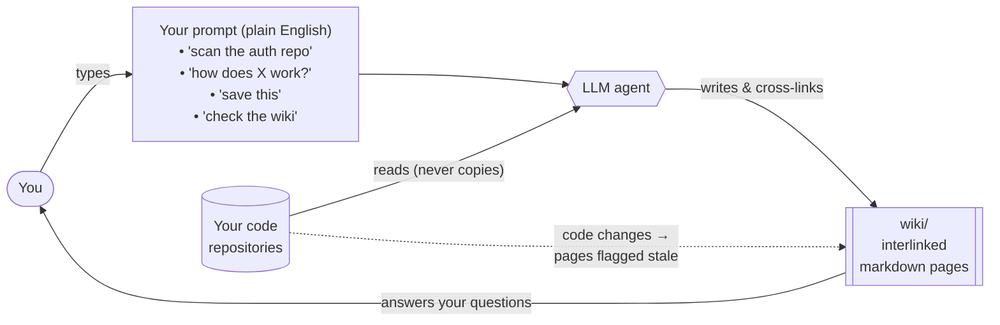

# LLM Code Wiki — Template

A ready-to-use template for a **knowledge base over living code repositories**, maintained by an LLM
agent. You curate sources and ask questions; the agent reads your code, writes interlinked
markdown pages, keeps them cross-referenced, and flags pages that go stale when the code changes.

Works on **macOS, Linux, and Windows** with no dependencies (uses your shell's built-in hashing),
and it's **dead simple to set up** — run one command and you're up and running in a few minutes.

## The big picture

**In one sentence:** you point the agent at code and ask questions; it reads the code, writes a
cross-linked wiki of what it learned, and flags pages as stale when the underlying code changes.

## Who is this for?

Anyone who accumulates knowledge across one or more codebases and is tired of re-deriving it every
time. For example:

- **Engineers onboarding to a large or unfamiliar codebase** — build a map that compounds instead
  of re-reading the same files.
- **Teams building a new system while learning from an existing one** — capture "how do they do X,
  how should we" as first-class `comparisons/` pages.
- **People studying reference / competitor / upstream repos** — keep a durable, cross-referenced
  understanding rather than scattered notes.
- **Anyone who wants design decisions, mental models, and vocabulary to persist** beyond chat
  history.

It's a good fit if your knowledge is rooted in **code that changes over time** (staleness is
handled). It's overkill if you just need a few static notes — and it's not a RAG index; it's a
synthesized, hand-curated (by the LLM) wiki.

## Setup (2 minutes)

1. Copy this template to a new folder and open it with your LLM agent (e.g. Claude Code).
2. Run **`/setup-wiki`** — it verifies hashing on your OS, then asks you a few things (what the
   wiki is about, your optional `scope:` tags, and which repos to track) and fills everything in.
   It also installs a global `wiki` skill so you can reach the wiki from any repo.

That's it. (Prefer to do it by hand? Edit the Purpose + `scope:` in `constitution.md`, fill
`repos.md`, and install the skill from `skills/wiki/SKILL.md` — see `/setup-wiki` step 5.)

## Daily use — just talk to your agent

There are **no special commands or exact wording** to memorize — ask in plain English and the
agent recognizes what you want. The phrasings below are just examples; say it however feels
natural.

| When you want to… | Say something like… | The agent… |
|---|---|---|
| Map out a repo | "scan / read / summarize `<repo>`" | reads it and writes `wiki/repositories/<repo>/overview.md` |
| Answer a question | "how does X work?" | answers from the wiki, offers to save the synthesis |
| Add another source | "add / import this article (or ticket)" | summarizes it and files it, cross-linked |
| Save what you figured out | "save this" / "file this" | writes it to `wiki/decisions/` or `wiki/concepts/` |
| Check the wiki is up to date | "check / audit the wiki" | flags out-of-date pages (via hashing), orphans, and gaps |

## How it works

- The knowledge lives in **`wiki/`** (open Obsidian there); the machinery (`constitution.md`,
  `repos.md`, `scripts/`, `skills/`) stays at the repo root, out of the vault.
- **`constitution.md`** is the schema — structure, page format, and workflows; the single source
  of truth. The global **`wiki`** skill reads it on every invocation (so the wiki works from any
  repo), and a short root **`CLAUDE.md`** redirects to it when you work inside this repo.
- Sources are **referenced + content-hashed, never copied**, so staleness is detectable.
- **`repos.md`** maps a repo name to wherever you cloned it.
- It's just a git repo of markdown — version history and Obsidian's graph view come free.

See `docs/example-decision-page.md` for a worked example of the page format.
